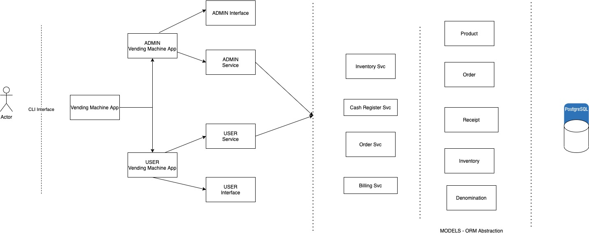

<!-- PROJECT LOGO -->
<br />
<p align="center">
  <h3 align="center">Karun's Vending Machine</h3>

  <p align="center">
    A simple vending machine CLI written in plain MRI Ruby and ActiveRecord with a PostgreSQL backend
  </p>
</p>


<!-- ABOUT THE PROJECT -->
## Functional Requirements

This is a CLI app with a database. Users and Administrators can use the CLI to perform their respective actions.

User Actions:
* View the product inventory
* Purchase a desired product by specifying quantity to buy and money (£)
* User will be returned appropriate balance (if possible) if they chose to not pay the exact amount


Admin Actions:
* View the product inventory
* View the cash register (See all denominations and quantity available)
* Register a new product
* Modify product stock
* Modify amount of change in Vending Machine Cash Register

<!-- TIME TAKEN -->
## Time Taken
4 hours

<!-- REVIEWERS -->
## Note to Reviewers
* All application files are in the `lib` directory
* The starting point of the application is the `vending_machine_app.rb` file
* Tests are in the `spec` directory
* Change calculation - Using a greedy approach to calculate the change denominations to be returned





### Built With
* Ruby (2.6.5)
* PostgreSQL
* ActiveRecord (Not Rails)
* Rspec


<!-- GETTING STARTED -->
## Getting Started

### Prerequisites
Make sure psql server is running locally
* PostgreSQL
```sh
brew install postgresql
```

### Installation

1 Copy Config
```sh
cp ./config/settings.yml.sample ./config/settings.yml
```

2 Run setup file
```sh
bin/setup
```


<!-- USAGE EXAMPLES -->
## Usage

To start the CLI run the following 
```sh
bin/vending_machine
```

To quit you can press `ctrl+c`

<!-- CONTACT -->
## Contact

Karun - main@vkarun.me

